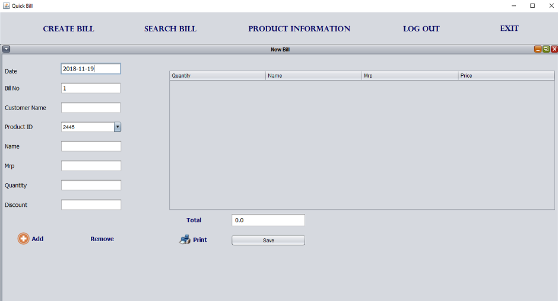

# Supermarket_Billing_System

The Project “Supermarket Billing System” deals with the automation of supermarket. This software will help salespersons in managing the various types of records pertaining to his/her customer.

The project has two users. First one is the Administrator who will manage all the details regarding stocks, cashiers as well as suppliers. He is the one who will decide the products available for customers and will look over the sales per day. The second one is the Cashier or the Billing Manager who can generate the bills for the customers.

### Additional files required to run the project

```
jcalendar-1.4.jar
mysql-connector-java-5.1.23-bin.jar
```

### Screenshots





